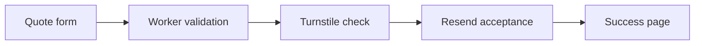

<div align="center">

Current maintenance status and remaining evidence: [roadmap](docs/project-state.md) · [docs index](docs/README.md).

<a href="https://cleaningbycassi.com">
  
</a>

<br /><br />

[](https://cleaningbycassi.com)
[](https://cleaningbycassi.com/quote)

[](https://github.com/Cassileigh/cleaning-by-cassi/actions/workflows/quality.yml)
[](https://github.com/Cassileigh/cleaning-by-cassi/actions/workflows/production-smoke.yml)
[](https://github.com/Cassileigh/cleaning-by-cassi/actions/workflows/production-integrity.yml)
[](https://github.com/Cassileigh/cleaning-by-cassi/actions/workflows/responsive.yml)
[](https://github.com/Cassileigh/cleaning-by-cassi/actions/workflows/accessibility.yml)
[](https://github.com/Cassileigh/cleaning-by-cassi/actions/workflows/safari.yml)
[](https://github.com/Cassileigh/cleaning-by-cassi/actions/workflows/lighthouse.yml)
[](https://astro.build)
[](https://workers.cloudflare.com)

### A cleaner home. A little more breathing room.

Dependable, detailed residential cleaning for busy families throughout the  
**Fox Cities and surrounding areas.**

[Services](https://cleaningbycassi.com/services) · [Pricing](https://cleaningbycassi.com/pricing) · [About Cassi](https://cleaningbycassi.com/about) · [Request a Quote](https://cleaningbycassi.com/quote)

</div>

---

## ✨ Welcome

Security maintenance: [current parity audit](docs/security-parity.md) · [520-commit AlienX comparison](docs/alienx-commit-inventory.md) · [quote contract](docs/quote-security-contract.md) · [release runbook](docs/release-runbook.md).

The September 16–17 audit adds required repository/history checks, post-deployment integrity verification, strict external-stylesheet CSP and matched compatible tooling. See the audit for exact source revisions, validation evidence, and remaining gaps; these are not a claim of zero vulnerabilities or complete security parity.

The September 19 follow-up enforces PRs and five GitHub Actions checks on `main`,
with up-to-date branches and no bypass actors. Every checkout disables persisted
credentials, and the dependency audit blocks all reported vulnerability severities.
Cloudflare's production branch and gated build/deploy commands were confirmed by
dashboard screenshot; disabling non-production builds was subsequently confirmed
by the owner. Remaining account checks are tracked explicitly in the audit.

Cleaning by Cassi is a locally owned residential cleaning business built around personal service, careful attention to detail, and making home feel lighter.

This repository contains the production website and its secure quote-request system. The experience is responsive, accessible, and designed around the same purple, blue, pink, and green identity used across Cleaning by Cassi's printed materials.

<table>
<tr>
<td width="50%" valign="top">

### For clients

- Clear service and starting-price information
- Personalized quote requests
- Mobile-friendly pages and forms
- Light and dark color-scheme support
- Friendly, straightforward communication

</td>
<td width="50%" valign="top">

### Built on trust

- Protected by Cloudflare Turnstile
- Server-side form validation
- Confirmed email acceptance before success
- Rate limiting and request-size limits
- Automated production health checks

</td>
</tr>
</table>

## 🏡 Brand artwork

<div align="center">
  <a href="https://cleaningbycassi.com">
    
  </a>
  <br />
  <sub>Select the artwork to visit the production website.</sub>
</div>

## 🧽 Services at a glance

| Service                | Designed for                                                    |
| :--------------------- | :-------------------------------------------------------------- |
| **Standard Cleaning**  | Regular upkeep that keeps a home fresh, tidy, and comfortable   |
| **Deep Cleaning**      | A detailed reset for spaces that need extra care                |
| **Recurring Cleaning** | Weekly, biweekly, every-three-weeks, or monthly support         |
| **Move-In / Move-Out** | Preparing a home for its next chapter                           |
| **Add-On Services**    | Custom extras such as baseboards, bed making, laundry, and more |

> Every home is different. Final quotes are based on the home's size, condition, rooms, and requested services.

<div align="center">

[](https://cleaningbycassi.com/quote)

</div>

## 💌 How a quote request works



The form navigates to the success page only after the email provider accepts the business notification. Acceptance is not proof of inbox delivery. JavaScript errors remain on the form; native submissions receive an HTML recovery page. Retries use provider idempotency keys for 24 hours.

## 🛡️ Security and reliability

The quote service validates requests before contacting Turnstile or the email provider. Safeguards include:

- Turnstile token, hostname, and action verification
- Same-origin submission enforcement
- Honeypot spam detection
- Cloudflare rate limiting: eight attempts per minute per IP within an edge location, plus an eight-per-ten-minute isolate safety net
- Fail-closed quote handling when the rate-limit binding is missing or unavailable
- Field allowlists, length limits, and HTML escaping
- Real request-body size enforcement
- Resend response-ID confirmation
- Browser security headers, including a script policy without unsafe-inline
- Hourly production smoke monitoring
- Post-smoke and daily production-integrity checks on both domains
- Automated responsive compatibility testing across eight public pages and 12 viewport sizes
- Automated light/dark WCAG and contrast testing across the public business pages
- Build, TypeScript, Cloudflare dry-run, and dependency checks
- GitHub CodeQL analysis
- Grouped Dependabot maintenance
- Required PRs and five source-bound GitHub Actions checks, with no bypass actors
- An exact-revision release gate requiring five successful workflows before `npm run deploy` proceeds

Edge-location counters are not a strict global quota. Provider acceptance and configuration readiness are not proof of inbox delivery. Browser quote tests mock verification and email submission; they send no email.

Please report vulnerabilities privately according to the [security policy](./SECURITY.md) or email **cassi@cleaningbycassi.com**.

## ♿ Accessibility and theme contract

Accessibility is a release requirement for Cleaning by Cassi. The website must remain readable and usable whether a visitor's device uses a light or dark appearance.

- Text and controls must maintain WCAG AA foreground/background contrast.
- Links, form fields, headings, body copy, and interactive controls must remain distinguishable in both themes.
- Keyboard focus indicators must remain clearly visible.
- Color must not be the only way a state or message is communicated.
- Semantic structure, labels, page titles, and language metadata must remain valid.
- `prefers-reduced-motion` must be respected.

The accessibility workflow tests eight routes in both light and dark modes with axe WCAG A/AA rules. Separate workflows run native macOS Safari plus WebKit navigation/quote recovery, and Lighthouse budgets: accessibility 95, best practices 95, performance 85, and SEO 95. The intentionally noindex quote receipt is excluded only from the SEO gate.

## 🎨 Brand system

| Color           |    Hex    | Role                                 |
| :-------------- | :-------: | :----------------------------------- |
| 🟣 Royal Purple | `#6F14D9` | Primary identity and calls to action |
| 🔵 Bright Blue  | `#1548F5` | Gradient depth and balance           |
| 🩷 Vibrant Pink | `#F24BB5` | Warmth, highlights, and personality  |
| 🟢 Fresh Green  | `#A7DF24` | Energetic accent details             |
| ⚫ Deep Plum    | `#211631` | Text and strong contrast             |

**Display type:** DM Serif Display  
**Body type:** Poppins

## ⚙️ Technology

| Layer           | Technology                                                             | Purpose                                                                 |
| :-------------- | :--------------------------------------------------------------------- | :---------------------------------------------------------------------- |
| Framework       | [Astro 7](https://astro.build)                                         | Pages, routing, and server rendering                                    |
| Runtime         | [Cloudflare Workers](https://workers.cloudflare.com)                   | Production hosting and quote processing                                 |
| Language        | [TypeScript](https://www.typescriptlang.org)                           | Safer application code                                                  |
| Spam protection | [Cloudflare Turnstile](https://www.cloudflare.com/products/turnstile/) | Private, server-verified bot protection                                 |
| Email           | [Resend](https://resend.com)                                           | Business and customer notifications                                     |
| Validation      | GitHub Actions                                                         | Build, security, responsive, accessibility, and production health gates |

Responsive AVIF/WebP images, locally hosted fonts, semantic HTML, reduced-motion support, and mobile-first styling keep the site fast and comfortable to use.

## ✅ Automated checks

### Daily email health check

The production Worker schedules one health email at **5:00 a.m. America/Chicago**
(Central time, including daylight saving) to the business quote mailbox. It uses
the same production Resend credential, sender and shared sending code as quotes.
The fixed-recipient job has no public HTTP trigger and never bypasses Turnstile.
Retries use one stable daily idempotency key. Receiving the message confirms this
delivery path for that message, not every customer submission or destination.
See [email monitoring](docs/email-health.md) for delivery checks and failure handling.

| Check                     | When it runs                                 | Coverage                                                                                        |
| :------------------------ | :------------------------------------------- | :---------------------------------------------------------------------------------------------- |
| **Quality**               | Push / PR to `main`                          | Regression tests, formatting, build, types, Worker dry run, dependency audit                    |
| **Responsive**            | Push / PR to `main`                          | Eight routes × 12 viewport sizes; overflow and browser errors                                   |
| **Accessibility & theme** | Push / PR to `main`                          | Light/dark axe checks, image loading, Chromium navigation and quote recovery                    |
| **Safari & WebKit**       | Push / PR to `main`                          | Native Safari plus WebKit quote recovery, navigation and keyboard-only light/dark journeys      |
| **Lighthouse**            | Push / PR to `main`                          | Accessibility ≥95, best practices ≥95, performance ≥85, SEO ≥95                                 |
| **CodeQL**                | GitHub security analysis                     | JavaScript/TypeScript and workflow analysis                                                     |
| **Production smoke**      | Push to `main`, hourly, or manual            | Exact deployed revision, public routes, configuration readiness, rejected invalid submissions   |
| **Production integrity**  | Successful main-push smoke, daily, or manual | Stable revision, eight routes on both domains, strict CSP/security headers, HTTPS and readiness |
| **Browser diagnostics**   | Manual only                                  | Isolates preview navigation failures; does not replace release checks                           |
| **Workers Build**         | Cloudflare Git integration                   | Production build and deployment                                                                 |

The five required release workflows are **quality, responsive, accessibility, Lighthouse, and Safari**. `npm run deploy` checks their successful push runs against the clean checkout and latest GitHub `main` SHA, then allows Wrangler to deploy. Missing, failed, skipped, or timed-out evidence blocks deployment. Production smoke checks the result afterward; newer checks supersede obsolete revisions.

Cloudflare must use **`npm run build`** as its build command and **`npm run deploy`** as its deploy command. Direct `wrangler deploy` bypasses the repository gate. See the [release runbook](docs/release-runbook.md) for account-setting verification and operational limits. Production is hosted on **Cloudflare Workers**, from **`main`**.

Changes must use temporary PR branches, pass the five required GitHub Actions
checks on an up-to-date branch, and merge normally. Direct pushes to `main` are
not the maintenance path. The ruleset requires zero human approvals for the solo
maintainer, but still requires PRs and passing checks. Production smoke/integrity
are post-deployment evidence, never pre-merge requirements.

## 📁 Project map

```text
/
├── .github/
│   ├── dependabot.yml             Grouped dependency updates
│   └── workflows/                 Release gates, production checks, and browser diagnostics
├── docs/                          Runbook, audit follow-up, security contract, and artwork
├── public/                        Images, icons, and local fonts
├── scripts/                       Image optimization, revision metadata, and CI gate
├── src/
│   ├── components/                Header, footer, metadata, and shared UI
│   ├── layouts/                   PageLayout: document shell for public pages
│   ├── pages/                     Website routes and API endpoints
│   └── styles/                    Brand, typography, and responsive styles
├── astro.config.mjs               Astro and Cloudflare adapter
├── wrangler.json                  Production Worker configuration
└── package.json                   Commands and pinned dependencies
```

All public business pages use `PageLayout.astro` for metadata, navigation, and footer, with shared spacing and system light/dark colors in `global.css`. The homepage uses those same light/dark colors for every section. The About photo is `public/cassi-family.jpg`; `scripts/optimize-images.mjs` generates its AVIF/WebP versions and the accepting-new-clients images.

The Astro starter blog routes, content collections, RSS/MDX integrations, placeholder images, and unused fonts are removed. The build decodes every raster image to reject corrupt files, and browser checks verify image loading and live system-theme switching. Only referenced website assets and their font licenses belong in `public/`; repository-only artwork belongs in `docs/`.

## 🚀 Local development

The project requires **Node.js 22 or newer**.

```bash
npm ci
npm run dev
```

Then open [localhost:4321](http://localhost:4321).

| Command                          | Purpose                                                             |
| :------------------------------- | :------------------------------------------------------------------ |
| `npm run dev`                    | Optimize images and start Astro development                         |
| `npm run build`                  | Generate revision metadata, optimize images, and build              |
| `npm test`                       | Run API, quote-client, and release-gate regression tests            |
| `npm run check`                  | Run regressions, type checks, production build, and Worker dry run  |
| `npm run audit`                  | Check the locked dependency tree; fail at low severity or above     |
| `npm run format:check`           | Verify maintained source and documentation formatting               |
| `npm run preview -- --port 4321` | Build and start the Cloudflare runtime with an HTTP loopback origin |
| `npm run test:browser`           | Run Playwright tests against the running preview                    |
| `npm run cf-typegen`             | Regenerate scoped Worker declarations                               |
| `npm run deploy`                 | Verify exact-revision CI, then deploy through Wrangler              |

The loopback preview configuration is intentional: it prevents production-origin HTTPS upgrading from breaking local Safari assets while retaining production security headers.

---

## 🔧 Maintenance and operations

Use the [release runbook](docs/release-runbook.md), [quote security contract](docs/quote-security-contract.md), and [audit follow-up](docs/audit-follow-up.md) for implementation details, evidence, and remaining account-level checks. GitHub is the source of truth: pull current `main` before making changes and inspect checks for that exact revision.

For browser verification:

```bash
npm ci
npx playwright install chromium webkit
npm run preview -- --port 4321
# In another terminal:
npm run test:browser
npx playwright test tests/quote-interactions.spec.cjs tests/navigation.spec.cjs --browser=webkit
```

Native Safari requires macOS and enabled Safari WebDriver; the Safari workflow configures both. Tests cover stale form state, retries, timeouts, back navigation, header containment, and active-tab visibility. Safari timeout messages use the actual timeout signal rather than relying on browser-specific error wording.

For local verification settings, copy `.dev.vars.example` to `.dev.vars` and use a dedicated Turnstile testing setup with matching hostnames. Automated browser tests mock verification and delivery and need no live email secrets. Production uses Worker secrets for `TURNSTILE_SECRET` and `RESEND_API_KEY`; hostname and site-key settings must match the intended widget. Never place production secrets in browser code.

The original header artwork is retained in `docs/brand`; the build generates a 344px WebP for visitors. Repository-only artwork stays in `docs/`, and served assets stay in `public/`.

### Verification evidence — September 19, 2026

The hardened release [`5fd4741`](https://github.com/Cassileigh/cleaning-by-cassi/commit/5fd4741c1cc3eaff65850848b0e097805b94ee31)
passed 48 tests, all five release workflows, CodeQL, production smoke and integrity
checks on both domains. npm reported zero vulnerabilities; that is not a guarantee
of complete security. PR #14 subsequently passed all five PR checks and updated
Prettier to 3.9.7 and Wrangler to 4.133.0. Each new main revision needs its own
release and production evidence; see [the audit](docs/security-parity.md) and
[GitHub Actions](https://github.com/Cassileigh/cleaning-by-cassi/actions).

The September 19 dashboard screenshot confirms GitHub Pages is disabled.
Cloudflare Workers remains the production host. Security scanning is enabled,
but private alert disposition, account controls and recovery evidence remain
separate checks; see the audit rather than treating green badges as certification.

---

<div align="center">


### Cleaning by Cassi

_Done with precision. Peace of mind delivered._

[Website](https://cleaningbycassi.com) · [Free Quote](https://cleaningbycassi.com/quote) · [Email Cassi](mailto:cassandramorris@cleaningbycassi.com)

<sub>Serving the Fox Cities and surrounding areas.</sub>

</div>

## Security closeout maintenance

Production Integrity isolates its trusted verification code from the release it
checks and disables package caching. On main pushes, Quality additionally requires
fresh Actions and JavaScript/TypeScript CodeQL analyses and zero open code-scanning
alerts. It uses a short-lived read-only workflow token; no new Cloudflare secret
is needed. Missing/stale evidence or any open alert blocks release. All five PR
checks remain required; a skipped PR-only instance of the main inventory job is
not live-alert verification.

Use `.dev.vars.example` for local Worker bindings. Keep secrets empty for static
pages and mocked tests. The Worker reads `TURNSTILE_SITE_KEY` at runtime, so no
`PUBLIC_*` build variable is introduced. See the [current roadmap](docs/project-state.md)
for dated delivery evidence, remaining account/device work and exact-revision
release requirements.
