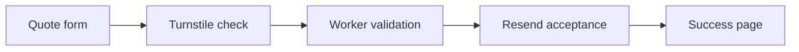

<div align="center">

<a href="https://cleaningbycassi.com">
  
</a>

<br /><br />

[](https://cleaningbycassi.com)
[](https://cleaningbycassi.com/quote)

[](https://github.com/Cassileigh/cleaning-by-cassi/actions/workflows/quality.yml)
[](https://github.com/Cassileigh/cleaning-by-cassi/actions/workflows/production-smoke.yml)
[](https://github.com/Cassileigh/cleaning-by-cassi/actions/workflows/responsive.yml)
[](https://astro.build)
[](https://workers.cloudflare.com)

### A cleaner home. A little more breathing room.

Dependable, detailed residential cleaning for busy families throughout the  
**Fox Cities and surrounding areas.**

[Services](https://cleaningbycassi.com/services) · [Pricing](https://cleaningbycassi.com/pricing) · [About Cassi](https://cleaningbycassi.com/about) · [Request a Quote](https://cleaningbycassi.com/quote)

</div>

---

## ✨ Welcome

Cleaning by Cassi is a locally owned residential cleaning business built around personal service, careful attention to detail, and making home feel lighter.

This repository contains the production website and its secure quote-request system. The experience is responsive, accessible, and designed around the same purple, blue, pink, and green identity used across Cleaning by Cassi's printed materials.

<table>
<tr>
<td width="50%" valign="top">

### For clients

- Clear service and starting-price information
- Personalized quote requests
- Mobile-friendly pages and forms
- Light and dark color-scheme support
- Friendly, straightforward communication

</td>
<td width="50%" valign="top">

### Built on trust

- Protected by Cloudflare Turnstile
- Server-side form validation
- Confirmed email acceptance before success
- Rate limiting and request-size limits
- Automated production health checks

</td>
</tr>
</table>

## 🏡 Website preview

<div align="center">
  <a href="https://cleaningbycassi.com">
    
  </a>
  <br />
  <sub>Select the preview to visit the production website.</sub>
</div>

## 🧽 Services at a glance

| Service | Designed for |
| :--- | :--- |
| **Standard Cleaning** | Regular upkeep that keeps a home fresh, tidy, and comfortable |
| **Deep Cleaning** | A detailed reset for spaces that need extra care |
| **Recurring Cleaning** | Weekly, biweekly, every-three-weeks, or monthly support |
| **Move-In / Move-Out** | Preparing a home for its next chapter |
| **Add-On Services** | Custom extras such as baseboards, bed making, laundry, and more |

> Every home is different. Final quotes are based on the home's size, condition, rooms, and requested services.

<div align="center">

[](https://cleaningbycassi.com/quote)

</div>

## 💌 How a quote request works



The success page appears only after the business notification has been accepted by the email provider. Failed validation or delivery stays on the form and gives the visitor a useful error instead of reporting a false success.

## 🛡️ Security and reliability

The production safeguards follow the same checks-and-balances approach used for the AlienX SmartHome project:

- Turnstile token, hostname, and action verification
- Same-origin submission enforcement
- Honeypot spam detection and per-IP rate limiting
- Field allowlists, length limits, and HTML escaping
- Real request-body size enforcement
- Resend response-ID confirmation
- Strict browser security headers
- Hourly production smoke monitoring
- Automated responsive compatibility testing across 72 page and viewport combinations
- Build, TypeScript, Cloudflare dry-run, and dependency-audit gates
- GitHub CodeQL analysis
- Grouped Dependabot maintenance

Please report vulnerabilities privately according to the [security policy](./SECURITY.md) or email **cassi@cleaningbycassi.com**.

## 🎨 Brand system

| Color | Hex | Role |
| :--- | :---: | :--- |
| 🟣 Royal Purple | `#6F14D9` | Primary identity and calls to action |
| 🔵 Bright Blue | `#1548F5` | Gradient depth and balance |
| 🩷 Vibrant Pink | `#F24BB5` | Warmth, highlights, and personality |
| 🟢 Fresh Green | `#A7DF24` | Energetic accent details |
| ⚫ Deep Plum | `#211631` | Text and strong contrast |

**Display type:** DM Serif Display  
**Body type:** Poppins

## ⚙️ Technology

| Layer | Technology | Purpose |
| :--- | :--- | :--- |
| Framework | [Astro 7](https://astro.build) | Pages, routing, and server rendering |
| Runtime | [Cloudflare Workers](https://workers.cloudflare.com) | Production hosting and quote processing |
| Language | [TypeScript](https://www.typescriptlang.org) | Safer application code |
| Spam protection | [Cloudflare Turnstile](https://www.cloudflare.com/products/turnstile/) | Private, server-verified bot protection |
| Email | [Resend](https://resend.com) | Business and customer notifications |
| Monitoring | GitHub Actions | Quality gates and hourly production checks |

Responsive AVIF/WebP images, locally hosted fonts, semantic HTML, reduced-motion support, and mobile-first styling keep the site fast and comfortable to use.

## ✅ Automated checks

| Check | When it runs | What it protects |
| :--- | :--- | :--- |
| **Quality** | Every push and pull request to `main` | Install, build, types, Worker dry run, and dependency audit |
| **Production smoke** | Every push to `main` and hourly | Both domains, quote page, success page, runtime bindings, and rejection behavior |
| **Responsive compatibility** | Every push and pull request to `main` | Six public pages at 12 viewport sizes for overflow and browser runtime errors |
| **CodeQL** | GitHub security analysis | JavaScript, TypeScript, and workflow vulnerabilities |
| **Workers Build** | Every production update | Cloudflare production deployment |

Only **`main`** is maintained and deployed to production.

## 📁 Project map

```text
/
├── .github/
│   ├── dependabot.yml             Grouped dependency updates
│   └── workflows/                 Quality, production, and responsive monitoring
├── docs/                          Repository artwork
├── public/                        Images, icons, and local fonts
├── scripts/                       Image optimization
├── src/
│   ├── components/                Header, footer, metadata, and shared UI
│   ├── layouts/                   Shared page structure
│   ├── pages/                     Website routes and API endpoints
│   └── styles/                    Brand, typography, and responsive styles
├── astro.config.mjs               Astro and Cloudflare adapter
├── wrangler.json                  Production Worker configuration
└── package.json                   Commands and pinned dependencies
```

## 🚀 Local development

The project requires **Node.js 22 or newer**.

```bash
npm ci
npm run dev
```

Then open [localhost:4321](http://localhost:4321).

| Command | Purpose |
| :--- | :--- |
| `npm run dev` | Optimize images and start the local development server |
| `npm run build` | Create the production build |
| `npm run check` | Build, type-check, and test a Cloudflare deployment bundle |
| `npm run audit` | Check dependencies for high-severity vulnerabilities |
| `npm run preview` | Build and preview with the Cloudflare runtime |
| `npm run deploy` | Deploy the current `main` release through Wrangler |

---

<div align="center">


### Cleaning by Cassi

*Done with precision. Peace of mind delivered.*

[Website](https://cleaningbycassi.com) · [Free Quote](https://cleaningbycassi.com/quote) · [Email Cassi](mailto:cassandramorris@cleaningbycassi.com)

<sub>Serving the Fox Cities and surrounding areas.</sub>

</div>
