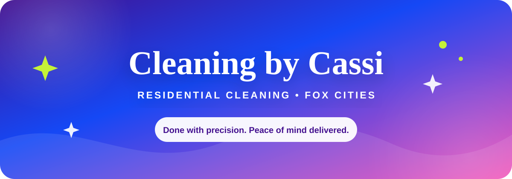
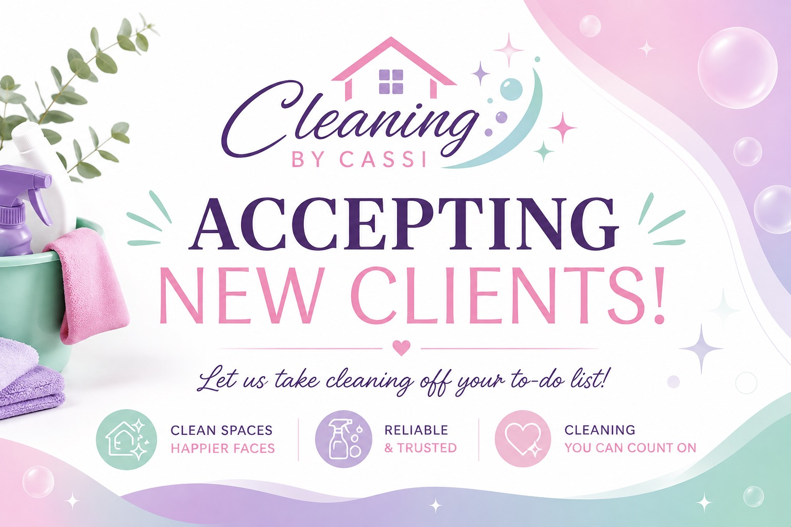
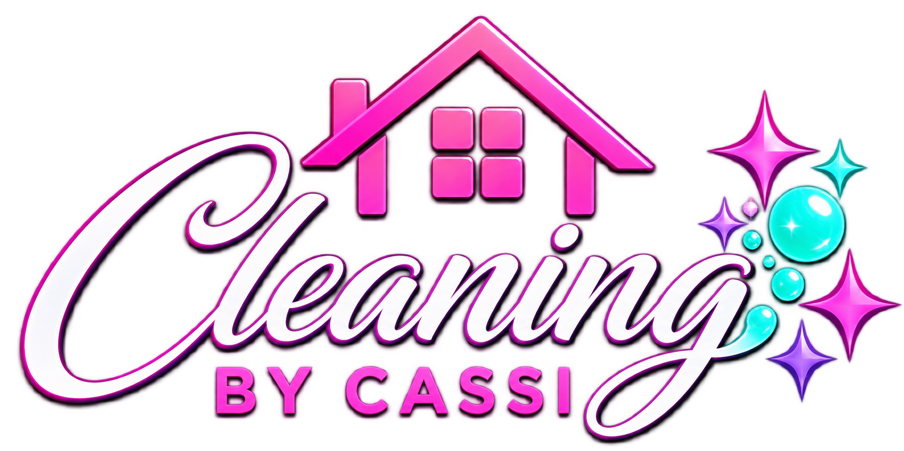

<div align="center">



<br />

[](https://cleaningbycassi.com)
[](https://cleaningbycassi.com/quote)
[](https://astro.build)
[](https://www.cloudflare.com)

### A cleaner home. A little more breathing room.

Dependable, detailed residential cleaning for busy families throughout the  
**Fox Cities & surrounding areas.**

[Explore Services](https://cleaningbycassi.com/services) · [View Pricing](https://cleaningbycassi.com/pricing) · [Meet Cassi](https://cleaningbycassi.com/about)

</div>

---

## ✨ About Cleaning by Cassi

Cleaning by Cassi is a locally owned residential cleaning business built around one simple goal: making home feel lighter.

Every clean is personal, detailed, and shaped around the home—not a one-size-fits-all checklist. The website makes it easy for clients to explore services, understand starting prices, and request a personalized quote from any device.

<table>
<tr>
<td width="50%">

### What clients can find

- Standard and deep cleaning options
- Recurring cleaning plans
- Flexible add-on services
- Clear starting-price information
- A simple, personalized quote form
- Real client experiences and reviews

</td>
<td width="50%">

### What the brand stands for

- 💗 Personal, friendly service
- ✨ Careful attention to detail
- 🐾 A pet-friendly approach
- 💚 Cleaning shaped around each home
- 🏡 More time for what matters
- 📱 A smooth mobile experience

</td>
</tr>
</table>

---

## 🏡 Website Preview

<div align="center">
  <a href="https://cleaningbycassi.com">
    
  </a>
  <br />
  <sub>Tap the image to visit the live website.</sub>
</div>

---

## 🧽 Services

| Service | Best for |
| :--- | :--- |
| **Standard Cleaning** | Regular upkeep that keeps the home fresh, tidy, and comfortable |
| **Deep Cleaning** | A detailed reset for spaces that need extra care |
| **Recurring Cleaning** | Weekly, biweekly, every-three-weeks, or monthly support |
| **Move-In / Move-Out** | Helping a home feel ready for its next chapter |
| **Add-On Services** | Custom extras such as baseboards, bed making, laundry, and more |

> Every home is different. Final quotes are based on the home's size, condition, rooms, and requested services.

<div align="center">

### Ready for a cleaner home?

[](https://cleaningbycassi.com/quote)

</div>

---

## 🎨 Brand & Design

The site uses the same bold, welcoming palette as Cleaning by Cassi's printed business materials.

| Color | Hex | Use |
| :--- | :---: | :--- |
| 🟣 Royal Purple | `#6F14D9` | Primary brand color and calls to action |
| 🔵 Bright Blue | `#1548F5` | Gradient depth and visual balance |
| 🩷 Vibrant Pink | `#F24BB5` | Highlights, warmth, and personality |
| 🟢 Fresh Green | `#A7DF24` | Accent color and energetic details |
| ⚫ Deep Plum | `#211631` | Readable text and contrast |

**Display type:** DM Serif Display  
**Body type:** Poppins

The interface automatically follows the visitor's light or dark device setting and is designed for phones, tablets, and desktop screens.

---

## ⚙️ Built With

- [Astro 5](https://astro.build) for the website framework
- [TypeScript](https://www.typescriptlang.org) for safer development
- [Cloudflare](https://www.cloudflare.com) for hosting and server-side delivery
- Local WOFF2 font files for fast, consistent typography
- Responsive images in AVIF, WebP, and JPG formats
- Semantic HTML, reduced-motion support, and mobile-first breakpoints

---

## 📁 Project Structure

```text
/
├── public/              Static images, icons, and local fonts
├── scripts/             Image optimization utilities
├── src/
│   ├── components/      Shared header, footer, and metadata
│   ├── layouts/         Reusable page layouts
│   ├── pages/           Home, About, Services, Pricing, and Quote
│   └── styles/          Global palette, typography, and responsive styles
├── astro.config.mjs     Astro and Cloudflare configuration
└── package.json         Commands and dependencies
```

---

## 🚀 Local Development

This project requires **Node.js 22 or newer**.

```bash
npm install
npm run dev
```

Open [http://localhost:4321](http://localhost:4321) to view the local site.

| Command | Purpose |
| :--- | :--- |
| `npm run dev` | Optimize images and start the development server |
| `npm run build` | Create the production build |
| `npm run preview` | Build and preview with Cloudflare locally |
| `npm run check` | Build, type-check, and run a dry deployment |
| `npm run deploy` | Deploy through Wrangler |

---

## 🌐 Live Site

The production website is available at **[cleaningbycassi.com](https://cleaningbycassi.com)**.

<div align="center">



**Cleaning by Cassi**  
*Done with precision. Peace of mind delivered.*

[Website](https://cleaningbycassi.com) · [Free Quote](https://cleaningbycassi.com/quote) · [Email](mailto:cassandramorris@cleaningbycassi.com)

<sub>Serving the Fox Cities & surrounding areas.</sub>

</div>
